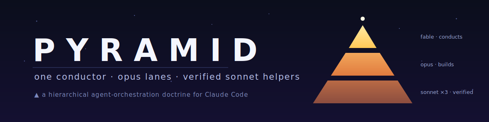
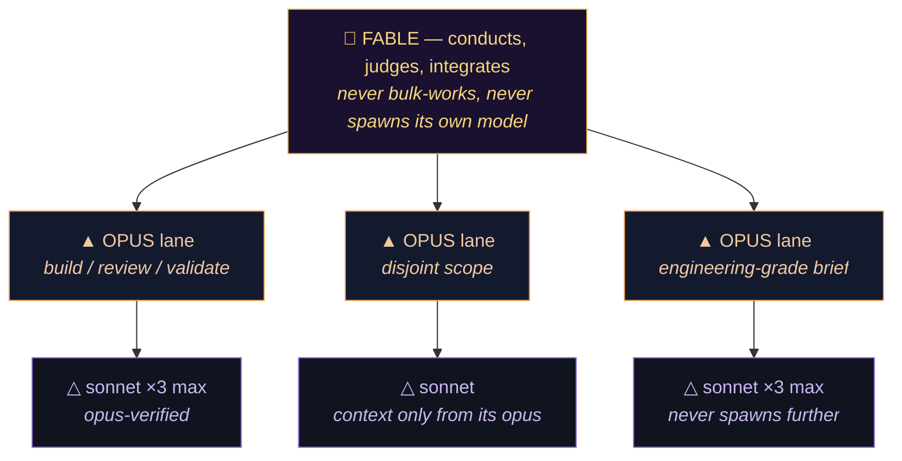
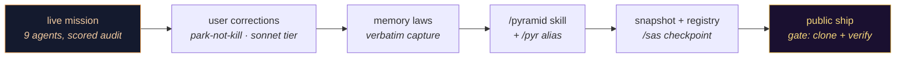

<div align="center">



[](https://github.com/fire17/pyramid/actions/workflows/ci.yml)
[](https://github.com/fire17/pyramid/releases)
[](LICENSE)
[](#-the-doctrine-at-a-glance)
[](#-the-park-protocol)
[](#-the-making-of)
[](https://github.com/fire17/pyramid/stargazers)

<i>Plurality below, a single accountable judgment above — an orchestra with two conductors is noise.</i>

**[🛑 Why this exists](#-the-part-that-should-stop-you)** · **[⚡ Quickstart](#-quickstart--30-seconds)** · **[🔺 The doctrine](#-the-doctrine-at-a-glance)** · **[🏛 Making-of](#-the-making-of)**

</div>

## 🛑 The part that should stop you

**This is a doctrine for commanding AI minds, written by the mind it governs — distilled from a mission it actually ran, with its own worst mistake recorded as law.**

- △ On 2026-07-06, one Claude Code session ran **9 agents** (5 review lanes + 4 build lanes) to score a Go codebase against an engineering doctrine and land the fixes — briefs with escalation clauses, `file:line` evidence, independent verification of every lane. The session transcript is retained as provenance (privately, by design — [`CONTINUE.md`](CONTINUE.md)).
- △ Mid-mission the user called a token-emergency pause. The session **killed the fleet when it should have parked it** — losing two builders' working context. The correction became the [park protocol](#-the-park-protocol), and the memory of the mistake ships in this repo: [`files/memory/pause-means-park-agents.md`](files/memory/pause-means-park-agents.md).
- △ The same day's token wall produced the economics tier: each opus worker may offload to **≤3 sonnet subagents it must verify entirely** — cheap throughput, supervised. That directive is also here, verbatim: [`files/memory/opus-sonnet-pyramid.md`](files/memory/opus-sonnet-pyramid.md).
- △ The skill's deepest rule is about *specs, not models*: every tier embeds the next tier's rules **verbatim** in its briefs, because a model fills spec gaps with confidence, not common sense. What a tier isn't told, it improvises.

> [!IMPORTANT]
> A hierarchy where every level is cheaper than the one above it — and **nothing unverified crosses a tier boundary**.

<div align="center">◭ △ ▲ △ ◭</div>

## ⚡ Quickstart — 30 seconds

```bash
git clone https://github.com/fire17/pyramid /tmp/pyramid
cp -R /tmp/pyramid/skills/pyramid ~/.claude/skills/pyramid
mkdir -p ~/.claude/skills/pyr && ln -s ../pyramid/SKILL.md ~/.claude/skills/pyr/SKILL.md
```

Then in Claude Code, type **`/pyramid`** (or `/pyr`) before spawning any agent wave. The skill also self-triggers on "agent swarm", "fan out", "opus agents".

## 🔺 The doctrine at a glance



| Tier | Who | The law | Why |
|---|---|---|---|
| ▲ apex | **Fable** (main) | Conducts, judges, integrates; verifies every lane **by sampling**; never spawns its own (most expensive) model | A worker's "it works" is a claim, not evidence — and the apex window is the priciest surface in the system |
| ◭ lanes | **Opus** workers | Disjoint file scopes; briefs carry outcome spec, boundary contract, escalation clause — verbatim | Delegation fails at the spec, not the worker |
| △ base | **Sonnet** helpers | ≤3 per opus, classic subagents, context only from their opus; the opus re-runs their tests, reads their diffs, asks *"anything better?"* unless perfect | Cheap throughput is only cheap if someone accountable verifies it |

The full text with every rule's rationale: [`skills/pyramid/SKILL.md`](skills/pyramid/SKILL.md) — plus the companion [`workflow-model-guard`](skills/workflow-model-guard/SKILL.md) (the never-spawn-the-conductor's-model guard with its pre-launch banner).

## ⏸ The park protocol

<details>
<summary><b>Pause ≠ kill — the rule this repo learned the hard way (click to expand)</b></summary>

1. **PARK, immediately, tier by tier** — main messages every active lane *"PARK NOW: stop all work this instant, stay resident, await resume"*; each opus relays to its live sonnets. Speed matters: active agents burn tokens while you compose prose.
2. **Do NOT terminate.** Parked agents burn **zero** tokens but keep their working context; killed agents leave half-written files and force finish-or-revert triage on resume. Kill only when explicitly told.
3. **Checkpoint after parking, never before** — parking is the urgent half; the durable state file (per-lane status, verified/unverified marks, resume sequence) comes second.
4. **On resume**, parked lanes continue with context intact.

</details>

## 🏛 The making-of

This repo is its own receipt — built, shipped, and verified by the session that lived the doctrine:



**Defects the process caught** (kept proudly — the process working is the product):
- The fleet-kill on a pause order → became §4 of the skill and a standing memory law.
- A progress report emitted mid-turn was never seen by the user → reports now land as final messages, and that rule rode into the skill's brief format.
- A worker flagged "lint failures" that were other agents' in-flight files → the quiescence rule (rerun before believing, never touch another agent's mid-write work) is embedded in every brief boilerplate.
- The session transcript was **excluded from this public repo on purpose** — it contains security-review findings of unpublished code. Honest maps mark their edges.

| Tooling used | Role |
|---|---|
| Claude Fable 5 (one session) | Author, orchestrator, and first subject of the doctrine |
| `/sas` + `/shipit` skills | Checkpoint → registry → publish pipeline, install-gate verified |
| `sync_skill.py` vault | Living skill library copy, provenance recorded |
| Hand-written SVG + CI | No generators; the banner and checks are in-repo, inspectable |

## 🛡 Safety & undo

| Concern | Answer |
|---|---|
| What does install touch? | Two directories: `~/.claude/skills/pyramid/` and `~/.claude/skills/pyr/` — nothing else |
| Settings/config clobbered? | Never — the skill is documentation the model loads; it changes no settings |
| Uninstall | `rm -rf ~/.claude/skills/pyramid ~/.claude/skills/pyr` |
| Does it phone home? | No code executes; it's a markdown doctrine |

## ✅ Trust

Claims here are enforced, not asserted: [CI](https://github.com/fire17/pyramid/actions/workflows/ci.yml) validates on every push that the banner is well-formed SVG, the skill's frontmatter and core laws (`≤3 sonnet`, `PARK`, `never Fable`) are present, and every relative link in this README resolves. Numbers in this page are observed from the originating session's ledger, not invented.

<div align="center">◭ △ ▲ △ ◭</div>

## ⭐ If a conductor somewhere runs a cleaner fleet because of this

A star is how one conductor signals another: *this map is honest*. The doctrine says claims fight or they retire — stars are where this one fights.

<div align="center">

[](https://star-history.com/#fire17/pyramid&Date)

</div>

## 🔗 Siblings

- [fable-masterclass](https://github.com/fire17/fable-masterclass) — the engineering laws the briefs are built from, distilled by the same mind.

## 📄 License

MIT © fire17

<div align="center"><sub><i>▲ written by the mind it governs · verified before believed · parked, never killed ▲</i></sub></div>
